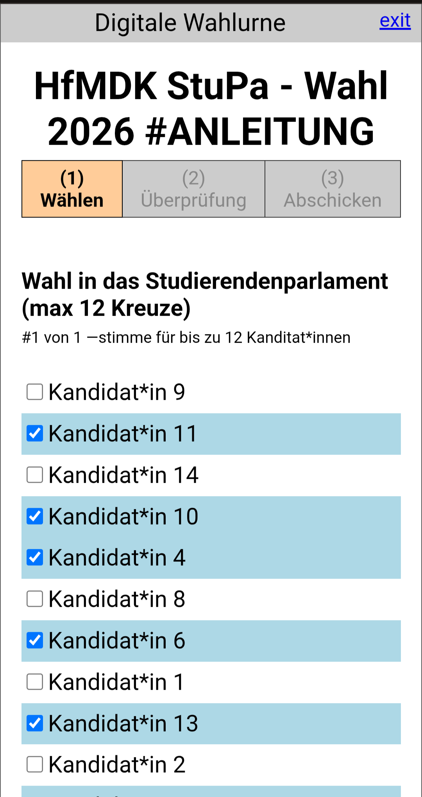
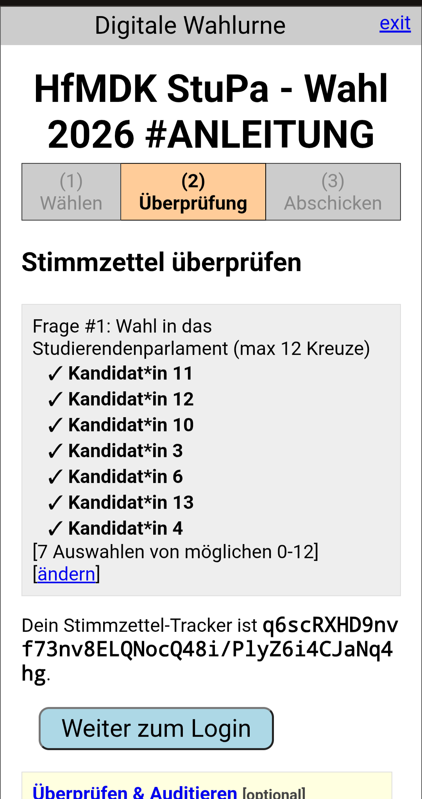

# HfMDK AStA Onlinewahl System

# HfMDK Wahlsystem

Dieses Projekt ist eine Instanz des (Open Source Programms) Helios Voting Systems, das für die Wahlen an der HfMDK Frankfurt vom AStA eingerichtet wurde. Es ermöglicht sichere, verifizierbare Online-Wahlen.

## Wahlvorgang

Der Wahlvorgang ist in drei Hauptschritte unterteilt, die die Integrität und Verifizierbarkeit der Wahl gewährleisten:

1.  **Stimme abgeben (Cast-as-Intended):**
    Die Wähler*innen erhalten eine Einladung per E-Mail mit einem Link zur Wahlurne.
    Der Stimmzettel wird online ausgefüllt. Die Wahl wird direkt im Browser der Wähler*innen verschlüsselt, sodass nur sie selbst die Klartext-Stimme kennen. Anschließend wird ein Nachweis (Zero-Knowledge Proof) generiert, der belegt, dass die Stimme gültig ist, ohne sie zu offenbaren.

2.  **Stimme aufzeichnen (Recorded-as-Cast):**
    Die verschlüsselte und anonymisierte Stimme wird an den Server gesendet und mit einem individuellen "Ballot Tracker" (Stimmzettel-Hash) versehen. Die Wähler*innen erhalten diesen Hash, um ihre Stimme später in der öffentlichen Liste der Stimmzettel zu finden und zu überprüfen, ob sie korrekt aufgezeichnet wurde. Die Stimmen sind zu diesem Zeitpunkt noch nicht entschlüsselbar.

3.  **Stimme auszählen (Tallied-as-Recorded):**
    Nach Ende der Wahl wird die Auszählung gestartet. Die verschlüsselten Stimmen werden mithilfe der öffentlichen Schlüssel der Trustees entschlüsselt. Jeder Trustee trägt mit seinem geheimen Schlüssel zur Entschlüsselung bei. Erst wenn alle Beiträge kombiniert werden, kann das endgültige Ergebnis berechnet werden. Das Ergebnis kann anschließend von jedem überprüft werden.

 

# Anleitung zur Onlinewahl 

Hier ist eine Schritt-für-Schritt-Anleitung für die Stimmabgabe und die Verifizierung deines Stimmzettels.

---

### 1. Email lesen

Du hast eine Email an deine Studi-Mail bekommen, in der du deine Anmeldedaten findest. Wenn du die Email nicht finden kannst oder keine bekommen hast, wende dich an den AStA. Klicke den Wahl-Link, um auf die Wahl-Seite zu kommen.

<b>Bild der Email mit Anmeldedaten</b>

### 2. Startseite der Wahlkabine

<b>Bild der Wahlkabine</b>

### 3. Stimmzettel ausfüllen

Zuerst wählst du deine gewünschte Kandidat*innen für aus. Nachdem du deine Wahl getroffen hast, klicke auf **"Weiter"**, um deine Auswahl zu bestätigen.

<b>Bild der Wahlkabine, Kandidat*innen ausgewählt</b>

---

### 4. Stimmzettel überprüfen

Nach der Bestätigung deiner Auswahl siehst du deinen ausgefüllten Stimmzettel. Hier wird ein einzigartiger **Stimmzettel-Tracker** angezeigt, mit dem du später nachvollziehen kannst, ob der Stimmzettel wirklich abgegeben wurde und grundsätzlich richtig verschlüsselt wird. Hier kannst du optional den aktuellen Stimmzettel verwerfen und verifizieren. 
Klicke sonst auf **"Weiter zum Login"**.

<b>Bild der Wahlkabine, Überprüfung</b>

---

### 5. Login, bevor der Stimmzettel abgschickt wird.

Um deinen Stimmzettel abzugeben musst du deine Wahlberechtigung verifizieren. Das tust du mit deinem Vornamen und Passwort. **Beides findest du in der Email!**

<b>Bild der Wahlkabine, Login</b>

### 6. Stimme Abgegeben.

<b>Stimme erfolgreich abgegeben</b>

---
### [Admin Docs](Admin-Docs.md) | [Admin Anleitung](Admin-Wahl-Anleitung.md) | [Entwickler Docs](Entwickler-Docs.md) 

---

